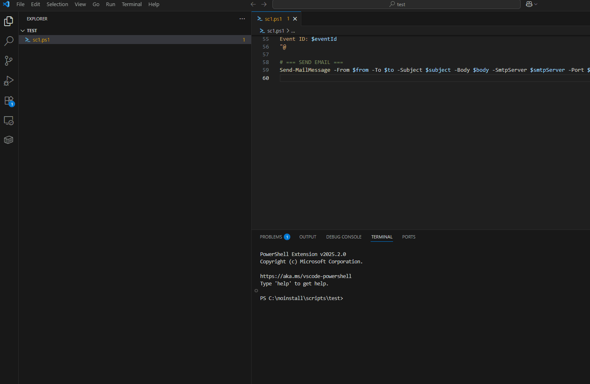

# Run Script as Admin

This Visual Studio Code extension allows you to run PowerShell scripts with elevated (Administrator) privileges using a simple command.

## ⚡ Features

- Run PowerShell (`.ps1`), Batch (`.bat`), or Command (`.cmd`) scripts with elevated privileges
- Right-click any supported script in the **Explorer sidebar** and choose **“Run PowerShell Script as Admin”**
- Automatically launches the script in a new elevated PowerShell 7+ window
- Supports Unicode and emoji in script content (requires PowerShell 7+)

## 🎥 Demo

Here’s how it works:

## 🖱️ How to Use

### Option 1: From the File Explorer

1. Right-click a `.ps1`, `.bat`, or `.cmd` file in the VS Code Explorer
2. Select **“Run PowerShell Script as Admin”**
3. Accept the UAC prompt
4. Your script runs in an elevated PowerShell 7+ window

### Option 2: From the Command Palette

1. Open the Command Palette (`Ctrl+Shift+P`)
2. Type and select **“Run PowerShell Script as Admin”**
3. Choose a script file when prompted

## 🛠 Requirements

- Windows OS
- [PowerShell 7+](https://github.com/PowerShell/PowerShell) installed and available as `pwsh` in your system PATH
- VS Code 1.50 or later

## Author

Created by [thimpat](https://github.com/thimpat)

